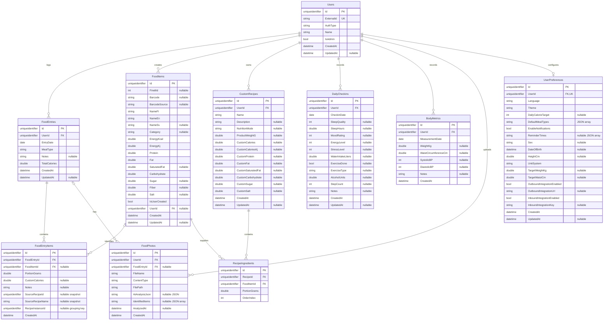
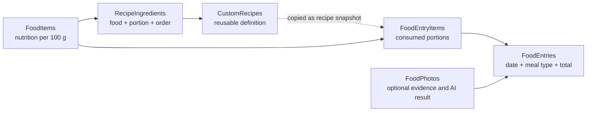

# Database

HealthLogger uses Entity Framework Core with either SQL Server or SQLite. The
provider is selected by the `DatabaseProvider` configuration value and its
matching connection string. SQL Server is the default.

The EF Core model is defined in
`HealthLogger/Data/HealthLoggerDbContext.cs`, and schema changes are tracked in
`HealthLogger/Migrations`. Migrations are applied automatically when the
application starts.

## Entity relationship diagram



`PK` means primary key, `FK` means foreign key, and `UK` means a unique key or
unique index. SQL Server stores GUIDs as `uniqueidentifier`, strings as
`nvarchar`, and `DateOnly` values as `date`. SQLite maps these logical types to
its native storage classes.

## Meal and recipe structure

Recipes and logged meals deliberately use different structures. A recipe is a
reusable definition, while a food entry records what was consumed on a date.



`FoodEntryItems.SourceRecipeId`, `SourceRecipeName`, and `RecipeInstanceId` do
not have database foreign keys. They preserve recipe provenance and group items
copied into a meal even if the reusable recipe later changes or is deleted.

## Field reference

All primary keys are application-generated GUIDs. Unless marked nullable, a
field is required by the current EF Core model.

### Users

| Field | Type | Description |
| --- | --- | --- |
| `Id` | GUID | Internal user identifier and primary key. |
| `ExternalId` | string | Identifier from the authentication provider; globally unique. |
| `AuthType` | string | Authentication mechanism used for the account. |
| `Name` | string | User display name. |
| `IsAdmin` | boolean | Whether the user has administrator privileges. |
| `CreatedAt` | datetime | UTC creation timestamp. |
| `UpdatedAt` | datetime, nullable | UTC timestamp of the latest update. |

### FoodItems

Food items are either shared Fineli records (`IsUserCreated = false`, normally
without a `UserId`) or user-owned records. Nutrient values describe 100 grams
of food.

| Field | Type | Description |
| --- | --- | --- |
| `Id` | GUID | Food item primary key. |
| `FineliId` | integer, nullable | Source identifier in the Fineli food database. |
| `Barcode` | string, nullable | Product barcode. Unique per user when both user and barcode are present. |
| `BarcodeSource` | string, nullable | Service or source from which barcode data was obtained. |
| `NameFi` | string | Finnish name. |
| `NameEn` | string | English name. |
| `NameSv` | string, nullable | Swedish name. |
| `Category` | string, nullable | Food category used for search and filtering. |
| `EnergyKcal` | double | Energy in kilocalories per 100 g. |
| `EnergyKj` | double | Energy in kilojoules per 100 g. |
| `Protein` | double | Protein in grams per 100 g. |
| `Fat` | double | Total fat in grams per 100 g. |
| `SaturatedFat` | double, nullable | Saturated fat in grams per 100 g. |
| `Carbohydrate` | double | Carbohydrate in grams per 100 g. |
| `Sugar` | double, nullable | Sugar in grams per 100 g. |
| `Fiber` | double, nullable | Fiber in grams per 100 g. |
| `Salt` | double, nullable | Salt in grams per 100 g. |
| `IsUserCreated` | boolean | Distinguishes user-created foods from shared source data. |
| `UserId` | GUID, nullable | Owner of a user-created item; null for shared foods. |
| `CreatedAt` | datetime | UTC creation timestamp. |
| `UpdatedAt` | datetime, nullable | UTC timestamp of the latest update or source sync. |

### FoodEntries

| Field | Type | Description |
| --- | --- | --- |
| `Id` | GUID | Meal entry primary key. |
| `UserId` | GUID | User who logged the meal. |
| `EntryDate` | date | Calendar date on which the meal was consumed. |
| `MealType` | string | Meal category: `breakfast`, `lunch`, `dinner`, or `snack`. |
| `Notes` | string, nullable | Free-form notes about the meal. |
| `TotalCalories` | double | Stored total energy in kilocalories for the entry. |
| `CreatedAt` | datetime | UTC creation timestamp. |
| `UpdatedAt` | datetime, nullable | UTC timestamp of the latest update. |

### FoodEntryItems

| Field | Type | Description |
| --- | --- | --- |
| `Id` | GUID | Logged item primary key. |
| `FoodEntryId` | GUID | Parent meal entry. |
| `FoodItemId` | GUID, nullable | Referenced food; optional for custom-calorie or recipe snapshot rows. |
| `PortionGrams` | double | Consumed quantity in grams. |
| `CustomCalories` | double, nullable | Explicit calorie value used instead of food-derived nutrition. |
| `Notes` | string, nullable | Notes specific to this item. |
| `SourceRecipeId` | GUID, nullable | Snapshot of the recipe identifier; not a foreign key. |
| `SourceRecipeName` | string, nullable | Snapshot of the recipe name at logging time. |
| `RecipeInstanceId` | GUID, nullable | Groups rows created from the same recipe insertion. |
| `CreatedAt` | datetime | UTC creation timestamp. |

### CustomRecipes

Custom nutrient fields support recipes whose nutrition is entered directly
instead of calculated from ingredient rows.

| Field | Type | Description |
| --- | --- | --- |
| `Id` | GUID | Recipe primary key. |
| `UserId` | GUID | Recipe owner. |
| `Name` | string | Recipe name. |
| `Description` | string, nullable | Recipe description or preparation notes. |
| `NutritionMode` | string, nullable | Custom nutrition basis: `per100g` or `perProduct`. |
| `ProductWeightG` | double, nullable | Total product weight when using `perProduct`. |
| `CustomCalories` | double, nullable | User-entered energy in kilocalories. |
| `CustomCaloriesKj` | double, nullable | User-entered energy in kilojoules. |
| `CustomProtein` | double, nullable | User-entered protein in grams. |
| `CustomFat` | double, nullable | User-entered total fat in grams. |
| `CustomSaturatedFat` | double, nullable | User-entered saturated fat in grams. |
| `CustomCarbohydrate` | double, nullable | User-entered carbohydrate in grams. |
| `CustomSugar` | double, nullable | User-entered sugar in grams. |
| `CustomSalt` | double, nullable | User-entered salt in grams. |
| `CreatedAt` | datetime | UTC creation timestamp. |
| `UpdatedAt` | datetime, nullable | UTC timestamp of the latest update. |

### RecipeIngredients

| Field | Type | Description |
| --- | --- | --- |
| `Id` | GUID | Ingredient row primary key. |
| `RecipeId` | GUID | Parent custom recipe. |
| `FoodItemId` | GUID | Food used as the ingredient. |
| `PortionGrams` | double | Ingredient quantity in grams. |
| `OrderIndex` | integer | Display and processing order within the recipe. |

### DailyCheckins

There can be at most one check-in per user and calendar date. Rating fields
use a 1-to-5 scale.

| Field | Type | Description |
| --- | --- | --- |
| `Id` | GUID | Check-in primary key. |
| `UserId` | GUID | User who recorded the check-in. |
| `CheckinDate` | date | Calendar date represented by the check-in. |
| `SleepQuality` | integer, nullable | Subjective sleep quality from 1 to 5. |
| `SleepHours` | double, nullable | Hours slept. |
| `MoodRating` | integer, nullable | Mood rating from 1 to 5. |
| `EnergyLevel` | integer, nullable | Energy rating from 1 to 5. |
| `StressLevel` | integer, nullable | Stress rating from 1 to 5. |
| `WaterIntakeLiters` | double, nullable | Water consumed in liters. |
| `ExerciseDone` | boolean, nullable | Whether exercise was completed. |
| `ExerciseType` | string, nullable | Type or description of exercise. |
| `AlcoholUnits` | double, nullable | Alcohol units consumed. |
| `StepCount` | integer, nullable | Number of steps recorded. |
| `Notes` | string, nullable | Free-form wellness notes. |
| `CreatedAt` | datetime | UTC creation timestamp. |
| `UpdatedAt` | datetime, nullable | UTC timestamp of the latest update. |

### BodyMetrics

| Field | Type | Description |
| --- | --- | --- |
| `Id` | GUID | Measurement primary key. |
| `UserId` | GUID | User to whom the measurement belongs. |
| `MeasurementDate` | date | Calendar date of measurement. |
| `WeightKg` | double, nullable | Body weight in kilograms. |
| `WaistCircumferenceCm` | double, nullable | Waist circumference in centimeters. |
| `SystolicBP` | integer, nullable | Systolic blood pressure in mmHg. |
| `DiastolicBP` | integer, nullable | Diastolic blood pressure in mmHg. |
| `Notes` | string, nullable | Free-form measurement notes. |
| `CreatedAt` | datetime | UTC creation timestamp. |

### FoodPhotos

Photo binaries are stored in the file system; this table stores their metadata,
meal association, and optional AI analysis.

| Field | Type | Description |
| --- | --- | --- |
| `Id` | GUID | Photo metadata primary key. |
| `UserId` | GUID | User who uploaded the photo. |
| `FoodEntryId` | GUID, nullable | Meal associated with the photo. |
| `FileName` | string | Original or stored file name. |
| `ContentType` | string | MIME type, such as `image/jpeg`. |
| `FilePath` | string | Path to the stored image file. |
| `AiAnalysisJson` | string, nullable | Serialized AI analysis response. |
| `IdentifiedItems` | string, nullable | JSON array of foods identified in the image. |
| `AnalyzedAt` | datetime, nullable | UTC timestamp when AI analysis completed. |
| `CreatedAt` | datetime | UTC upload timestamp. |

### UserPreferences

Each user can have at most one preferences row.

| Field | Type | Description |
| --- | --- | --- |
| `Id` | GUID | Preferences primary key. |
| `UserId` | GUID | User owning the preferences; unique. |
| `Language` | string | UI language; defaults to `fi`. |
| `Theme` | string | `light`, `dark`, or `auto`; defaults to `auto`. |
| `DailyCalorieTarget` | integer, nullable | Daily calorie goal in kilocalories. |
| `DefaultMealTypes` | string | JSON array of enabled meal categories. |
| `EnableNotifications` | boolean | Whether reminders are enabled. |
| `ReminderTimes` | string, nullable | JSON array of reminder times. |
| `Sex` | string, nullable | Profile sex value, currently `male` or `female`. |
| `DateOfBirth` | datetime, nullable | Date of birth. |
| `HeightCm` | double, nullable | Height in centimeters. |
| `UnitSystem` | string | `metric` or `imperial`; defaults to `metric`. |
| `TargetWeightKg` | double, nullable | Target weight in kilograms. |
| `TargetWaistCm` | double, nullable | Target waist circumference in centimeters. |
| `OutboundIntegrationEnabled` | boolean | Enables outbound integration calls. |
| `OutboundIntegrationUrl` | string, nullable | Destination URL for outbound integration. |
| `InboundIntegrationEnabled` | boolean | Enables inbound integration access. |
| `InboundIntegrationKey` | string, nullable | Key used to authenticate inbound integration requests. |
| `CreatedAt` | datetime | UTC creation timestamp. |
| `UpdatedAt` | datetime, nullable | UTC timestamp of the latest update. |

## Relationships and deletion behavior

| Parent | Child | Cardinality | On parent deletion |
| --- | --- | --- | --- |
| `Users` | `FoodEntries` | one-to-many | Cascade |
| `Users` | `FoodItems` | one-to-many, optional child ownership | Cascade |
| `Users` | `CustomRecipes` | one-to-many | Cascade |
| `Users` | `DailyCheckins` | one-to-many | Cascade |
| `Users` | `BodyMetrics` | one-to-many | Cascade |
| `Users` | `FoodPhotos` | one-to-many | Cascade |
| `Users` | `UserPreferences` | one-to-zero-or-one | Cascade |
| `FoodEntries` | `FoodEntryItems` | one-to-many | Cascade |
| `FoodEntries` | `FoodPhotos` | one-to-many, optional association | No database cascade; the nullable FK is cleared by the application when tracked. |
| `FoodItems` | `FoodEntryItems` | one-to-many, optional association | Restrict |
| `CustomRecipes` | `RecipeIngredients` | one-to-many | Cascade |
| `FoodItems` | `RecipeIngredients` | one-to-many | Restrict |

The restrictive food-item relationships prevent deletion of foods that are
still used by logged meals or recipes.

## Indexes and uniqueness

| Table | Indexed fields | Purpose |
| --- | --- | --- |
| `Users` | `ExternalId` (unique) | Authentication lookup and identity uniqueness. |
| `FoodItems` | `FineliId` | Fineli import and synchronization lookup. |
| `FoodItems` | `NameFi`, `NameEn`, `Category` | Food search and filtering. |
| `FoodItems` | `UserId`, `Barcode` (unique when both are non-null) | Prevents duplicate user barcode products. |
| `FoodEntries` | `UserId`; `UserId`, `EntryDate` | User history and date-range queries. |
| `FoodEntryItems` | `FoodEntryId`; `FoodItemId` | Meal loading and food-reference checks. |
| `CustomRecipes` | `UserId` | Recipe lookup by owner. |
| `RecipeIngredients` | `RecipeId`; `FoodItemId` | Recipe loading and food-reference checks. |
| `DailyCheckins` | `UserId`, `CheckinDate` (unique) | One daily check-in per user. |
| `BodyMetrics` | `UserId`, `MeasurementDate` | Metric history and trends. |
| `FoodPhotos` | `UserId`; `FoodEntryId` | User gallery and meal photo lookup. |
| `UserPreferences` | `UserId` (unique) | Enforces one preferences row per user. |

## Initialization and food data

At startup, `Database.Migrate()` applies pending migrations. The food seeder
then synchronizes shared Fineli records from
`HealthLogger/food-data/fineli/foods.json`:

1. Existing source foods are updated when nutrient or name data changes.
2. New Fineli IDs are inserted as shared food items.
3. Source foods absent from the file are removed only when no meal item refers
   to them.

Create a migration after changing an entity or the model configuration:

```powershell
dotnet ef migrations add <MigrationName> --project HealthLogger
dotnet ef database update --project HealthLogger
```

Treat migrations as the authoritative history of the physical schema. Update
this document whenever a migration adds or changes tables, relationships,
constraints, or fields.